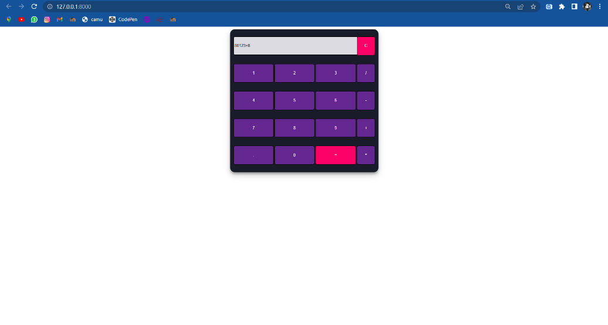
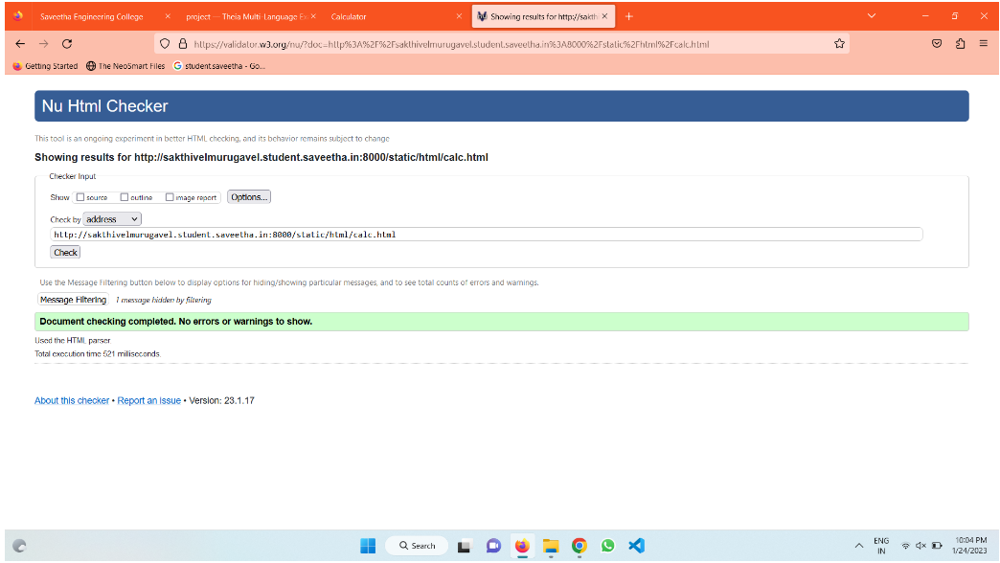

# Design of a Standard Calculator

## AIM:

To design a web application for a standard calculator.

## DESIGN STEPS:

### Step 1:
Clone the github repository and create Django admin interface.

### Step 2:
Change settings.py file to allow request from all hosts.

### Step 3:
Use CSS for creating attractive colors.

### Step 4:
Write JavaScript program for implementing five different operations.

### Step 5:
Validate the HTML and CSS code.

### Step 6:
Publish the website in the given URL.

## PROGRAM :
```
<!DOCTYPE html>
<html lang="en" dir="ltr">

<head>
<meta charset="utf-8">
<title>Simple Calculator using HTML, CSS and JavaScript</title>
<style>

    .calculator {
    padding: 10px;
    border-radius: 1em;
    height: 480px;
    width: 500px;
    margin: auto;
    background-color: #191b28;
    box-shadow: rgba(0, 0, 0, 0.19) 0px 10px 20px, rgba(0, 0, 0, 0.23) 0px 6px 6px;
    }
    
    .display-box {
    font-family: 'Orbitron', sans-serif;
    background-color: #dcdbe1;
    border: solid black 0.5px;
    color: black;
    border-radius: 5px;
    width: 100%;
    height: 65%;
    }
    
    #btn {
    background-color: #fb0066;
    }
    
    input[type=button] {
    font-family: 'Orbitron', sans-serif;
    background-color: #64278f;
    color: white;
    border: solid black 0.5px;
    width: 100%;
    border-radius: 5px;
    height: 70%;
    outline: none;
    }
    
    input:active[type=button] {
    background: #e5e5e5;
    -webkit-box-shadow: inset 0px 0px 5px #c1c1c1;
    -moz-box-shadow: inset 0px 0px 5px #c1c1c1;
    box-shadow: inset 0px 0px 5px #c1c1c1;
    }
</style>
</head>

<body>

<table class="calculator" >
<tr>
<td colspan="3"> <input class="display-box" type="text" id="result" disabled /> </td>

<!-- clearScreen() function clears all the values -->
<td> <input type="button" value="C" onclick="clearScreen()" id="btn" /> </td>
</tr>
<tr>
<!-- display() function displays the value of clicked button -->
<td> <input type="button" value="1" onclick="display('1')" /> </td>
<td> <input type="button" value="2" onclick="display('2')" /> </td>
<td> <input type="button" value="3" onclick="display('3')" /> </td>
<td> <input type="button" value="/" onclick="display('/')" /> </td>
</tr>
<tr>
<td> <input type="button" value="4" onclick="display('4')" /> </td>
<td> <input type="button" value="5" onclick="display('5')" /> </td>
<td> <input type="button" value="6" onclick="display('6')" /> </td>
<td> <input type="button" value="-" onclick="display('-')" /> </td>
</tr>
<tr>
<td> <input type="button" value="7" onclick="display('7')" /> </td>
<td> <input type="button" value="8" onclick="display('8')" /> </td>
<td> <input type="button" value="9" onclick="display('9')" /> </td>
<td> <input type="button" value="+" onclick="display('+')" /> </td>
</tr>
<tr>
<td> <input type="button" value="." onclick="display('.')" /> </td>
<td> <input type="button" value="0" onclick="display('0')" /> </td>

<!-- calculate() function evaluates the mathematical expression -->
<td> <input type="button" value="=" onclick="calculate()" id="btn" /> </td>
<td> <input type="button" value="*" onclick="display('*')" /> </td>
</tr>
</table>

<script>
    function clearScreen() {
        document.getElementById("result").value = "";
        }
        
        // This function display values
        function display(value) {
        document.getElementById("result").value += value;
        }
        
        // This function evaluates the expression and returns result
        function calculate() {
        var p = document.getElementById("result").value;
        var q = eval(p);
        document.getElementById("result").value = q;
        }
</script>

</body>

</html>
```

## OUTPUT:


## HTML VALIDATOR:


## RESULT:

